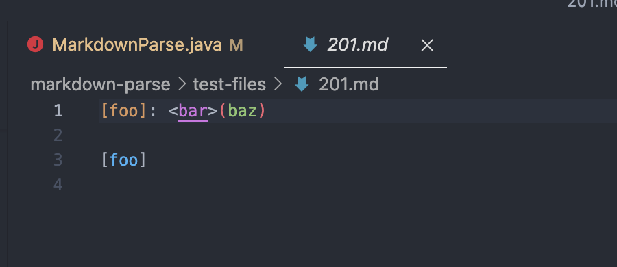
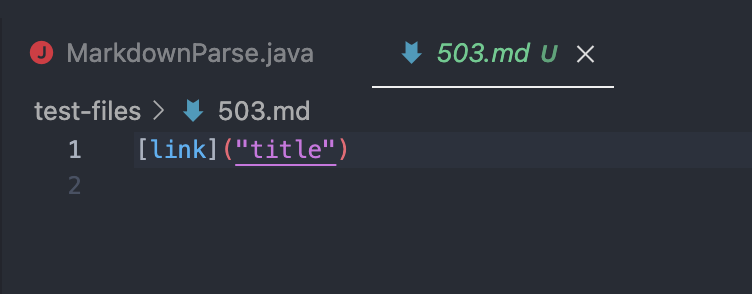
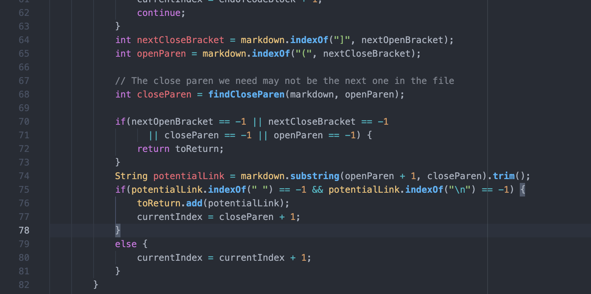
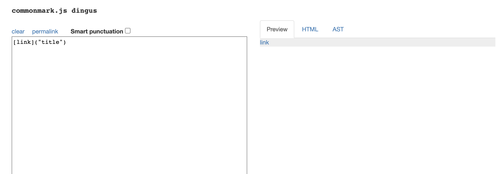
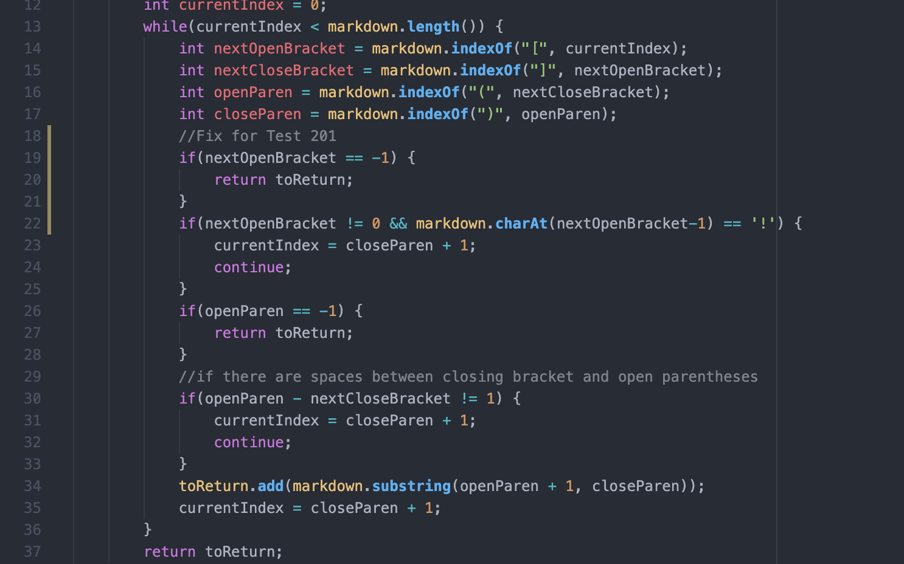

# Lab Report #5 Week 10

## Chosen Tests 
1. Test 201 (test-files/201.md)

2. Test 503 (test-files/503.md)

## Obtaining Outputs from Running Chosen Tests

### 1. Test 201 

#### My Implementation

#### 2. Week 9 Lab Implementation 

### 2. Test 503 

#### 1. My Implementation 

* Exception Message: 

#### 2. Week 9 Lab Implementation 

Each of the tests with different results were found by manually going through the `results.txt` file for each implementation, after running `bash script.sh > results.txt` in the terminal for both. I initially used `diff` on the results, but I wasn't able to spot comparisons as easily compared to scrolling through the two files manually. 

--- 

## Test 201 

1. The implementation that had the correct output, according to [CommonMark Demo Site](https://spec.commonmark.org/dingus/), was my implementation: 

    

    The expected output was [] since according to the preview, there is no link present. This matches with the output from my implementation. 

    **My Implementation:** 
    

    **Week 9 Lab Implementation:**
    

2. The bug in the week 9 lab implementation that may have caused the wrong output is that it doesn't necessarily check if there is an open parentheses immediately after the closing bracket. Because of this, if there are open and closing parentheses and both an open parentheses and closing parentheses are on the same line, the content in between the two parentheses will be returned. This shows why there was an output [baz], rather than [] for the week 9 lab implementation. 

    
    Additionally, since the condition of the if statement is true, baz is added to the `toReturn` ArrayList when it shouldn't have. A potential fix for this bug can be adding an `if` statement after line 65, checking if `openParen - nextCloseBracket != 1`, or the index of `nextCloseBracket` is 1 less than `openParen`. 

    

    The fix above would allow the week 9 implementation to have the expected output: 

    

## Test 503 

1. The implementation that had the correct output, according to [CommonMark Demo Site](https://spec.commonmark.org/dingus/), was the week 9 lab implementation: 

    

    The expected output was ["title"] since there is a valid link present, according to the preview on the CommonMark demo website. This matches with the output from the week 9 lab implementation. 

    **My Implementation**
    

    * Exception Message: 
    

    **Week 9 Lab Implementation**
    

2. According to the output in the terminal when running `bash script.sh` for my implementation, a `StringIndexOutOfBoundsException` was thrown when running the particular test. After further inspecting the test file, I noticed that my implementation would throw such exceptions when there was an empty line following the last link. In order to resolve this bug and prevent this symptom from showing up, an `if` statement could be added prior to the `if` statement checking whether or not the supposed link is an image (line 22): 

Above, the proposed fix is found at lines 19 to 21. It checks if there is a `nextOpenBracket` present - if not, this implies that there are no more links in the markdown file, and that we can exit out of the method.

